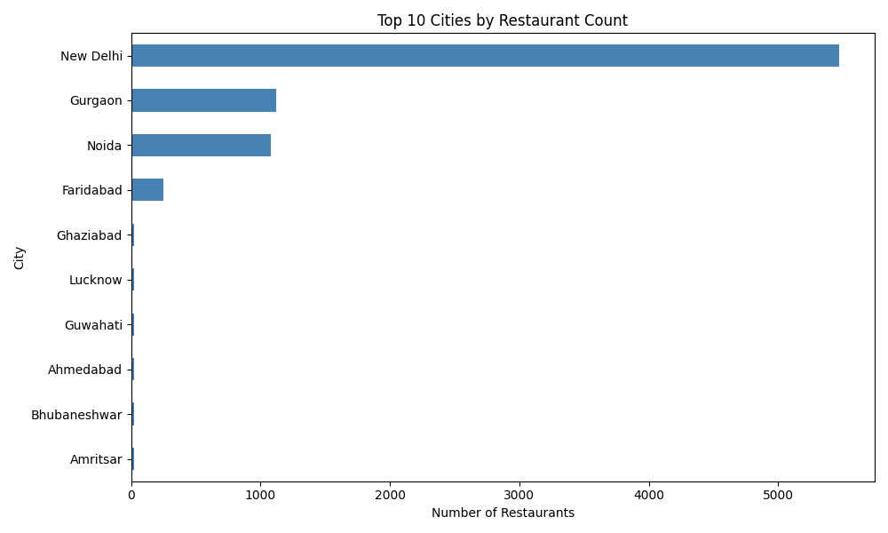

# Restaurant Location Analysis using Python

Analyze restaurant distribution, city dynamics, and locality patterns to extract business intelligence from geographic data.

## Download

[](https://github.com/dipayansamanta172-lgtm/Location-Analysis-Exploration-using-Machine-Learning/archive/refs/heads/main.zip)
[](https://github.com/dipayansamanta172-lgtm/Location-Analysis-Exploration-using-Machine-Learning/raw/main/Dataset.csv)

## Overview

This project performs comprehensive geographic analysis on 9,551 restaurants across 141 cities to understand location-based patterns. Location analysis reveals which neighborhoods have the highest restaurant concentrations, how ratings vary by city, and which areas attract premium dining establishments.

Understanding restaurant distribution helps identify market saturation, competitive advantages, and expansion opportunities. The analysis examines city density, locality distribution, rating patterns by location, and price range trends across geographic areas.

## Features

- City and locality distribution analysis
- Restaurant density calculation by location
- Rating analysis by city and locality
- Price range breakdown by location
- Latitude and longitude coordinate analysis
- High-rated restaurant location identification
- Cuisine distribution across top cities
- Automated visualization generation
- Comprehensive output report

## Technologies Used

- Python 3
- Pandas (data manipulation and analysis)
- NumPy (numerical computations)
- Matplotlib (visualization)

## Dataset

**Dataset.csv** contains 9,551 restaurant records.

**Location Fields:**
- City (141 unique cities)
- Locality (geographic subdivisions within cities)
- Latitude & Longitude (geographic coordinates)

**Rating & Price Fields:**
- Aggregate rating (0.0 - 4.9 scale)
- Price range (1-4 scale)
- Cuisine types

## Repository Structure

```
.
├── task4.py                    # Location analysis script
├── Dataset.csv                 # Restaurant data
├── output.txt                  # Detailed analysis report
├── location_analysis_graph.png # City distribution visualization
└── README.md
```

## How It Works

1. **Dataset Loading** - Reads 9,551 restaurant records with geographic data
2. **Data Cleaning** - Validates coordinates and handles missing values
3. **Location Analysis** - Counts restaurants by city and locality
4. **City Analysis** - Calculates rating and price statistics per city
5. **Locality Analysis** - Examines neighborhood-level patterns
6. **Rating Analysis** - Maps restaurant quality to geographic areas
7. **Visualization** - Generates bar chart of top cities by restaurant count
8. **Output Generation** - Creates comprehensive analysis report

## Sample Output Graph



## Running the Project

**Windows:**
```bash
python task4.py
```

**Linux/macOS:**
```bash
python3 task4.py
```

Output files generate automatically in the same directory.

## Installation

### Prerequisites

[](https://www.python.org/downloads/)
[](https://code.visualstudio.com/)

### Install Required Libraries

**Windows:**
```bash
pip install pandas
pip install numpy
pip install matplotlib
```

**Linux/macOS:**
```bash
pip3 install pandas
pip3 install numpy
pip3 install matplotlib
```

## Output Files

**output.txt** - Detailed location analysis containing:
- Restaurant count by city and locality
- City density rankings and concentration statistics
- Coordinate analysis (latitude/longitude ranges)
- Average ratings by city and locality
- Average price ranges by location
- High-rated restaurant distribution
- Cuisine preferences by top cities
- Location patterns and geographic insights

**location_analysis_graph.png** - Horizontal bar chart displaying the top 10 cities by restaurant count

## Results

- New Delhi dominates with 5,473 restaurants (57.3% of total dataset)
- 141 unique cities represented across the dataset
- Top 3 cities: New Delhi (5,473), Gurgaon (1,118), Noida (1,080)
- 1,826 unique cuisine combinations across 146 cuisine types
- Connaught Place is the highest-density locality with 122 restaurants
- Higher-priced restaurants (price range 4) average 3.82 rating
- Budget restaurants (price range 1) average 2.00 rating
- Valid latitude/longitude coordinates available for 100% of restaurants
- North Indian (3,960), Chinese (2,735), and Fast Food (1,986) lead cuisine distribution

## Future Improvements

- Implement clustering analysis to identify restaurant neighborhood types
- Add geospatial heatmaps for visual density distribution
- Calculate optimal new restaurant locations based on competitive gaps
- Build demographic analysis by city for target market identification
- Create interactive map visualization with restaurant details

---

**Dataset Source:** Restaurant data from multiple cities  
**Author:** Dipayan Samanta  
**License:** Open source
